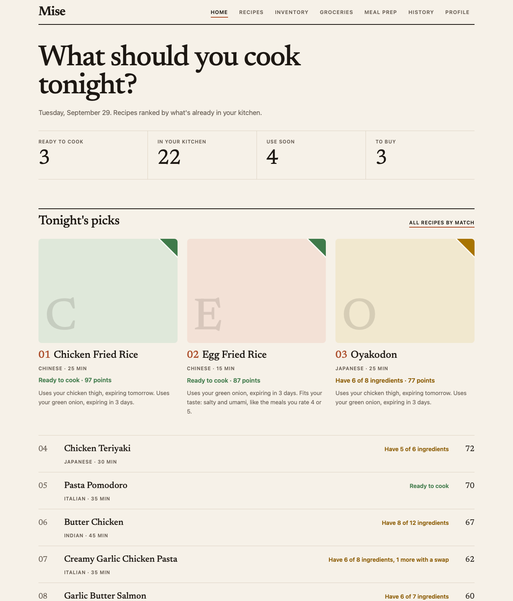
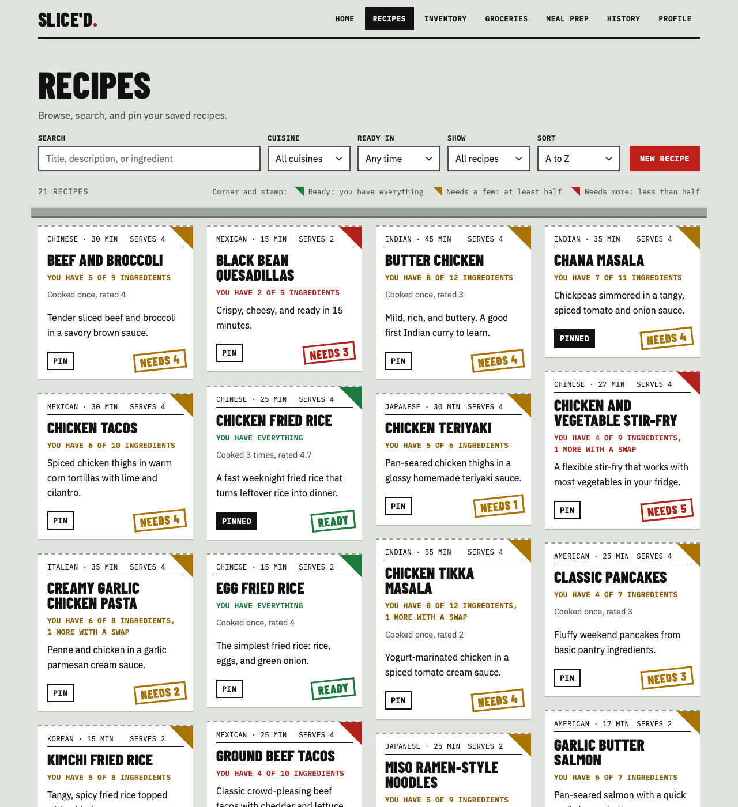
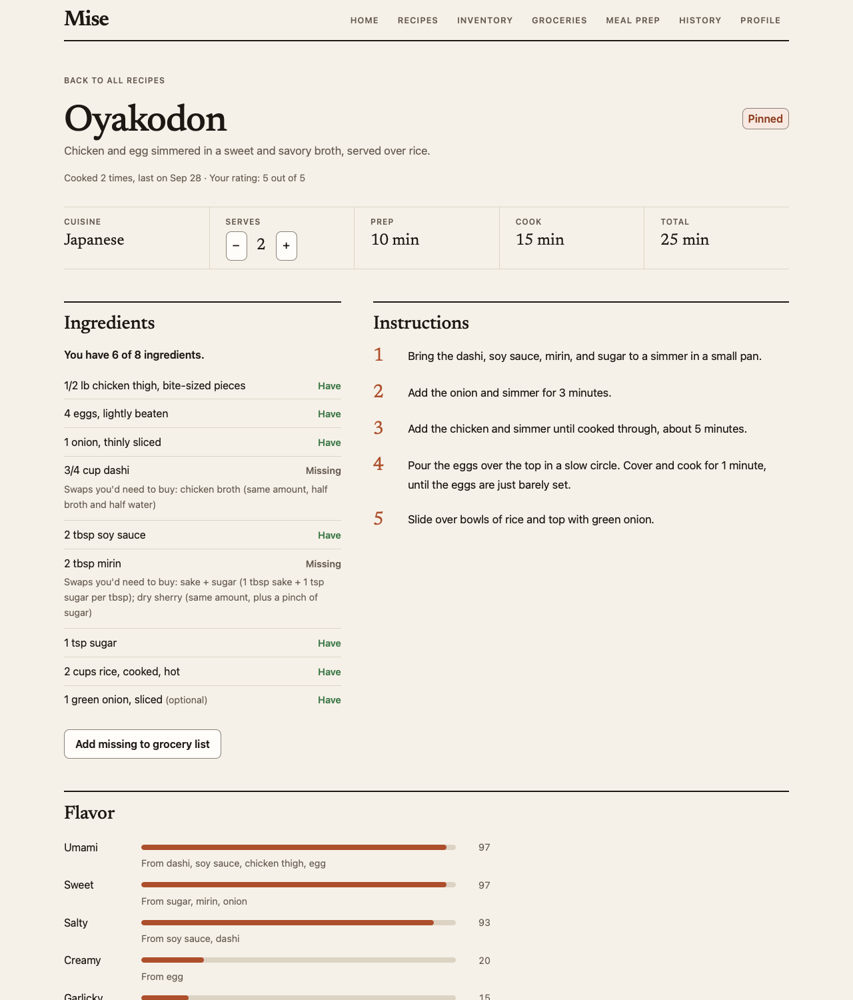
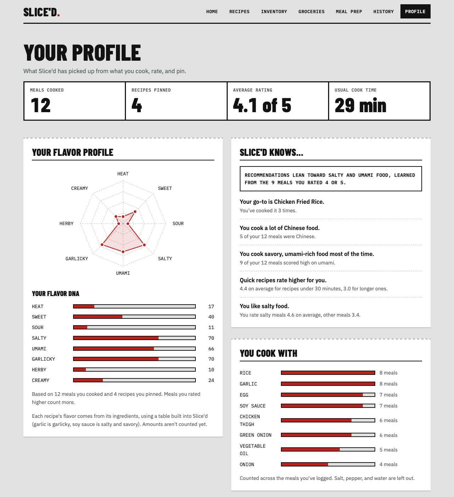
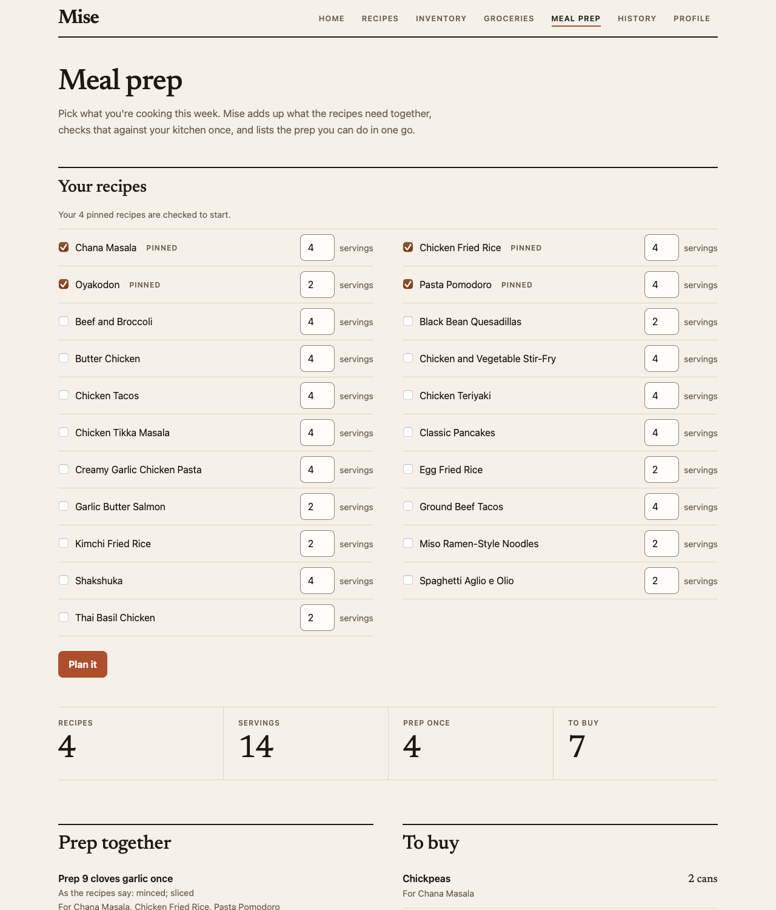
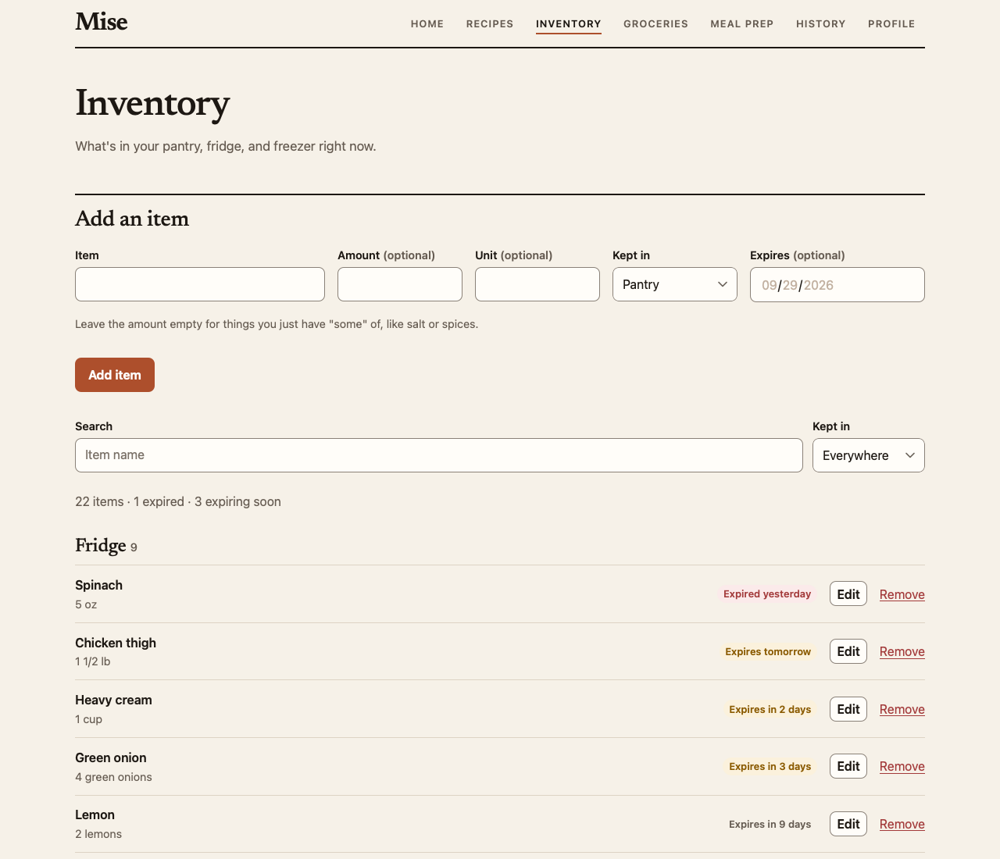
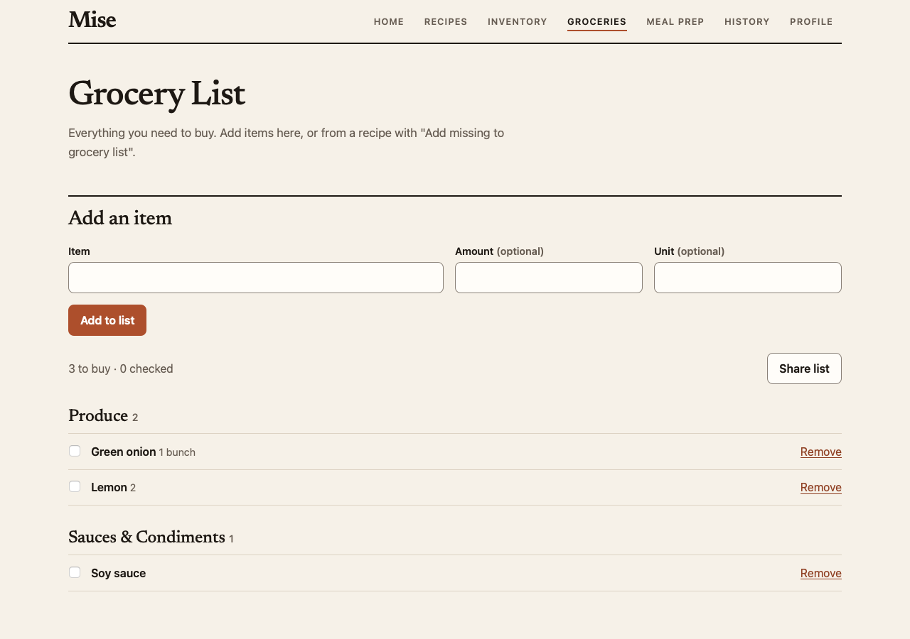

# Slice'd

[](https://github.com/ronroyc/sliced/actions/workflows/tests.yml)

Slice'd is a cooking app I built to answer one question: what can I make with what's already in my kitchen?

You keep track of what's in your pantry, fridge, and freezer, and Slice'd checks every recipe against it. It shows what you can cook tonight, what you're missing, and what's about to go bad. Rate what you cook and it picks up what you like. Whatever you're short on goes on a grocery list.



## Features

### Your kitchen and your recipes
- An inventory for the pantry, fridge, and freezer, with amounts and expiration dates.
- Every recipe is checked against the inventory, one ingredient at a time: have it, not enough, expired, or missing. Slice'd knows "eggs" and "egg" are the same thing, that scallions are green onions, and how to compare 2 cups with 1 tbsp.
- Recipes look like order tickets with a stamp: green READY if you have everything, mustard NEEDS 2 if you have at least half, red NEEDS 5 if you have less than half.
- Scale any recipe up or down. Amounts convert and show as kitchen fractions, so 6 tsp becomes 2 tbsp.

### Picking what to cook
- Each recipe gets a score out of 100, and you can see where the points came from: up to 70 for ingredients you have, 20 for using food before it expires, and 10 for matching your taste.
- Your taste comes from your ratings. Slice'd looks at the meals you rated 4 or 5, works out what they have in common (salty and savory, say), and moves similar recipes up the list.
- About 60 common substitutions, checked against what you have ("Swap: use your linguine, same amount"). With an API key added, you can also ask AI for ideas.
- A profile page with your stats, a flavor chart, the ingredients you use most, and a few notes about how you cook. A note only shows up once there's enough data to back it.

### Planning and shopping
- Meal prep: pick a few recipes for the week and Slice'd adds up everything they need, checks it against your kitchen, and tells you what you can prep once for all of them ("Cook 13 cups rice once").
- A grocery list sorted by store section. Add what's missing from any recipe, and amounts of the same thing get combined. After shopping, checked items move into your inventory. You can also send the list to your phone.
- Cooking history. Log a meal, rate it, take what you used out of the inventory, and put leftovers in the fridge with a 4-day date.

### Adding recipes
- Paste a link and Slice'd imports the recipe. Most recipe sites publish their recipes in a standard format (schema.org JSON-LD); Slice'd reads it and splits each ingredient line into amount, unit, and name, without AI. For sites that block this, a "Save to Slice'd" bookmark in Safari grabs the recipe from the page you're on.
- Add your own photos, or keep the one from the recipe site.

## Screenshots

| Recipes as order tickets | A recipe |
|---|---|
|  |  |
| **Profile** | **Meal prep** |
|  |  |
| **Inventory** | **Grocery list** |
|  |  |

It works on a phone too: [home page on a phone](docs/screenshots/home-phone.png). The screenshots use the demo data (see below).

## How it's built

| Layer      | Choice                                                      |
|------------|-------------------------------------------------------------|
| Frontend   | HTML, CSS, vanilla JavaScript (no framework, no build step) |
| Backend    | Python, FastAPI                                             |
| Database   | SQLite via SQLAlchemy                                       |
| Validation | Pydantic                                                    |
| Testing    | pytest (about 470 tests), plus WebKit checks with Playwright |
| AI         | Anthropic API, optional (ingredient recognition, substitution ideas) |

```
Browser ──HTTP──▶ FastAPI (one server)
                   ├── /api/*   → JSON API routes → services (the logic) → SQLAlchemy → SQLite
                   └── /*       → static frontend files (frontend/)
```

A few choices behind it:
- Most of Slice'd is plain code, not AI. Matching, unit conversion, scoring, taste, meal prep, and importing all follow fixed rules, so the same kitchen always gives the same results and every number can be traced back. AI only handles two things rules can't: identifying an ingredient Slice'd has never seen, and suggesting less obvious swaps. The app works fine without it.
- Your data stays on your computer, in one SQLite file and a photos folder. The fonts are bundled too, so pages don't load anything from the internet.
- The app looks like a restaurant kitchen line, the place where every slice gets prepped: recipes are tickets on a rail, short lists are chalkboards, and numbers sit on a board. The colors are steel gray, white, black, and tomato red. Headings use Barlow Condensed and the rest uses IBM Plex Mono and IBM Plex Sans.
- Text meets WCAG AA contrast (tests check it), everything works from the keyboard, and screen readers get labels. Color is never the only signal: every colored corner also has a stamp in words.

For more, [docs/WALKTHROUGH.md](docs/WALKTHROUGH.md) goes through the code and the libraries, [docs/GLOSSARY.md](docs/GLOSSARY.md) explains the terms, and [docs/CHANGES.md](docs/CHANGES.md) lists every change in order.

## How I made it

I designed Slice'd and made the calls on what it's for, which features to build and which to cut, how recipes are scored and colored, keeping data on your own computer, and how it looks. I used [Claude Code](https://claude.com/claude-code), an AI coding tool, to write much of the code, and I reviewed and tested every change, including in Safari. [docs/CHANGES.md](docs/CHANGES.md) covers how it came together, bugs included.

## Running locally

Requires Python 3.9+.

```bash
git clone https://github.com/ronroyc/sliced.git
cd sliced

python3 -m venv .venv
source .venv/bin/activate
pip install -r requirements.txt

cp .env.example .env       # optional: add ANTHROPIC_API_KEY to turn on the AI features

cd backend
python -m app.database.seed   # load the sample recipes and inventory (safe to run again)
uvicorn app.main:app --reload
```

Open http://127.0.0.1:8000. Interactive API docs (generated by FastAPI): http://127.0.0.1:8000/docs

### Demo mode

To see every feature with data behind it (a stocked kitchen, pinned recipes, and two weeks of rated meals), build a separate demo database. It never touches your own:

```bash
cd backend
python -m app.database.demo ../data/demo.db
DATABASE_URL=sqlite:///../data/demo.db uvicorn app.main:app --port 8001
```

### On Windows

Install Python from [python.org](https://www.python.org/downloads/) (tick "Add python.exe to PATH"), download the repo as a ZIP from the green Code button, unzip it, and open PowerShell in that folder:

```powershell
py -m venv .venv
.venv\Scripts\python -m pip install -r requirements.txt
cd backend
..\.venv\Scripts\python -m app.database.demo ..\data\demo.db
$env:DATABASE_URL="sqlite:///../data/demo.db"
..\.venv\Scripts\python -m uvicorn app.main:app --port 8001
```

Then open http://127.0.0.1:8001.

## Database

```
recipes ──< recipe_ingredients >── ingredients ──< inventory_items
```

Recipes and ingredients are many-to-many, so a join table (`recipe_ingredients`) connects them and stores the quantity, unit, and prep note for each pairing. Inventory items point at the same `ingredients` rows, one item per ingredient. See [docs/WALKTHROUGH.md](docs/WALKTHROUGH.md) for the full explanation.

## API

| Method | Path | Purpose |
|---|---|---|
| GET | `/api/health` | Server and database status |
| GET | `/api/recipes` | List recipes (`?search=`, `?cuisine=`, `?max_total_time=`, `?pinned=true`) |
| GET | `/api/recipes/cuisines` | Cuisines in use |
| GET | `/api/recipes/{id}` | One recipe with ingredients (`?servings=` to scale it) |
| GET | `/api/recipes/{id}/match` | Which ingredients are in the inventory: have, short, expired, missing (`?servings=`) |
| POST | `/api/recipes` | Create a recipe |
| PATCH | `/api/recipes/{id}` | Update a recipe |
| DELETE | `/api/recipes/{id}` | Delete a recipe (and its photo) |
| POST | `/api/recipes/import` | Read a recipe from a website (`{"url": ...}`) into a draft for the form; nothing is saved |
| POST | `/api/recipes/import-data` | The same, from recipe data the "Save to Slice'd" Safari button read from the page |
| POST | `/api/recipes/{id}/photo/from-url` | Download a photo for a recipe (used for imported recipes) |
| POST | `/api/recipes/{id}/substitutes` | AI ideas for replacing one ingredient (`{"ingredient": ...}`, `?servings=`); explains itself when no API key is set |
| GET | `/api/ai/status` | Whether AI features are on (an API key is set) |
| POST | `/api/meal-prep/plan` | Several recipes at once (`{"recipes": [{"id": 3, "servings": 4}]}`): one combined shopping list checked against the inventory, and what to prep together |
| POST | `/api/meal-prep/grocery` | Put that combined shopping list on the grocery list |
| GET | `/api/profile` | Stats, flavor profile, most-used ingredients, and "Slice'd knows..." observations (each only with enough data) |
| GET | `/api/recipes/{id}/flavor` | A recipe's flavor on 8 scales, and which ingredients each comes from |
| PUT / DELETE | `/api/recipes/{id}/pin` | Pin or unpin a recipe |
| PUT / DELETE | `/api/recipes/{id}/photo` | Upload a photo (the request body is the image: JPEG, PNG, WebP, or HEIC, up to 15 MB) or remove it |
| GET | `/api/photos/{filename}` | A recipe photo (stored in `data/photos`) |
| GET | `/api/recommendations` | Recipes ranked by what's in the kitchen, with score and reasons and a green/yellow/red color (`?search=`, `?cuisine=`, `?max_total_time=`, `?limit=`, `?pinned=true`) |
| GET | `/api/grocery` | Grocery list, unchecked first, grouped by store section |
| GET | `/api/grocery/text` | What's left to buy as plain text, one item per line (for the Reminders Shortcut in `docs/REMINDERS_SHORTCUT.md`) |
| POST | `/api/grocery` | Add an item (combines with the same ingredient when the units convert) |
| PATCH | `/api/grocery/{id}` | Check it off or change the amount |
| DELETE | `/api/grocery/{id}` | Remove an item |
| POST | `/api/grocery/from-recipe/{recipe_id}` | Add what a recipe needs that you don't have (`?servings=`) |
| POST | `/api/grocery/stock-checked` | Move checked items into the inventory |
| DELETE | `/api/grocery/checked` | Remove checked items without stocking them |
| POST | `/api/recipes/{id}/cooked` | Log a cooked recipe; optionally subtract what it used from the inventory |
| GET | `/api/history` | Everything cooked, newest first (`?recipe_id=`) |
| PATCH | `/api/history/{id}` | Rate it, or change the notes or date |
| DELETE | `/api/history/{id}` | Remove a history entry |
| GET | `/api/inventory` | List inventory (`?search=`, `?location=`, `?expires_within=`) |
| GET | `/api/inventory/{id}` | One inventory item |
| POST | `/api/inventory` | Add an item (409 with `existing_id` if that ingredient is already there, even spelled differently) |
| PATCH | `/api/inventory/{id}` | Update an item |
| DELETE | `/api/inventory/{id}` | Remove an item |
| GET | `/api/ingredients` | All known ingredient names |
| POST | `/api/ingredients/identify` | AI suggestion for a new ingredient name (saves nothing) |

## Environment variables

| Name                | Required | Purpose                                         |
|---------------------|----------|-------------------------------------------------|
| `DATABASE_URL`      | No       | Defaults to `sqlite:///data/sliced.db`            |
| `ANTHROPIC_API_KEY` | No       | Turns on the AI features: ingredient recognition and substitution ideas |
| `PHOTOS_DIR`        | No       | Where recipe photos are stored. Defaults to `data/photos`   |

Secrets go in `.env`, which is git-ignored. Never commit real keys.

## Running tests

From the project root, with the virtual environment active:

```bash
pytest
```

Tests use a temporary database, so they never touch `data/sliced.db`, and a fake AI client, so they never call the Anthropic API. On GitHub, `.github/workflows/tests.yml` runs them on every push.

## Project structure

```
sliced/
├── backend/
│   ├── app/
│   │   ├── api/          # HTTP routes: read request, call service, return response
│   │   ├── models/       # SQLAlchemy tables
│   │   ├── schemas/      # Pydantic validation for API input/output
│   │   ├── services/     # business logic and database queries
│   │   ├── database/     # engine, sessions, seed and demo scripts, column migrations
│   │   ├── config.py     # settings from environment variables
│   │   └── main.py       # creates the FastAPI app, error handlers
│   └── tests/
├── frontend/             # HTML pages, css/, js/, fonts/ (Barlow Condensed, IBM Plex, self-hosted)
├── docs/                 # walkthrough, product direction, Reminders Shortcut, screenshots
├── .github/workflows/    # runs the tests on every push
├── data/                 # seed_recipes.json, seed_inventory.json + SQLite database (db not committed)
├── requirements.txt
└── DEVELOPMENT_PLAN.md
```
